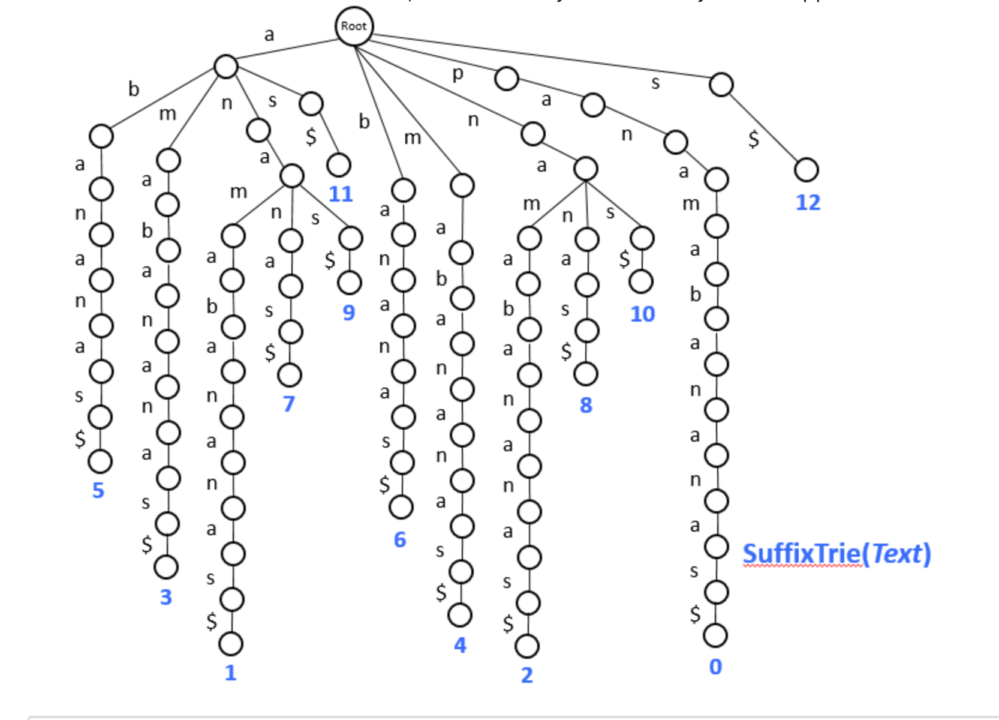

### 1.
    from genome sequencing to pattern matching
    brute force approach to pattern matching
    herding patterns into Trie
    herding text into suffix Trie
    from suffix Tries to suffix Trees

    
    Herding text into suffix tree:
        new idea: packing text onto a bus
        - generate all suffixes of text
        - form a trie out of these suffixes (suffix trie)
        - for each pattern, check if it can be spelled out from root downward in the suffix trie

#### Suffix Trie of text:

#### Suffix Tree of text:

since each suffix adds one leaf and at most one 
interval vertex to the suffix tree:
`# of vertices < 2 |text|`

Hence, memory footprint of suffix tree: `O(|text|)`

- storing edge labels

constructing suffix tree naive approach
Quadratic runtime: O(|text|^2)

